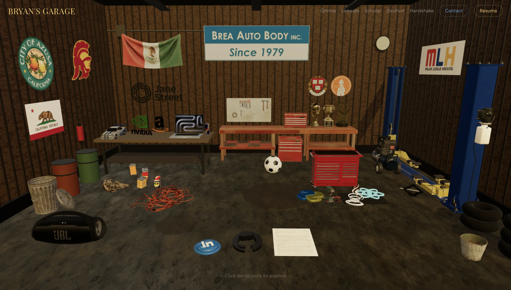

# Garage Portfolio

An immersive 3D portfolio experience built as an interactive auto body garage.

**Live site:** [bryanram.com](https://bryanram.com)

---

## Why a 3D Garage?

My dad works at Brea Auto Body, a collision repair shop in Southern California. I started working there at 15 during the pandemic to help bring more money home for my family. I grew up around cars, tools, and the hum of a working garage — so this portfolio recreates that environment in 3D. Every object you click (the workbench, the toolbox, the boombox) maps to a real section of my story: experience, projects, skills, cultura, and more.

---

## Tech Stack

![React] ![TypeScript] ![Vite] ![Three.js] ![TailwindCSS] ![GSAP]

- **React 19** + **TypeScript** + **Vite 7**
- **Three.js** via React Three Fiber + Drei
- **Tailwind CSS v4** (theme tokens in CSS, no config file)
- **GSAP** for camera animations
- **Zustand** for state management
- **Motion** (Framer Motion) for UI transitions
- **detect-gpu** for adaptive quality scaling

---

## Features

- **Interactive 3D garage** — click on objects to explore portfolio sections (experience, projects, skills, education, awards, hackathons, cultura, soccer, and more)
- **Kickable soccer ball with real physics** — click it for the soccer story, or drag-and-flick to kick it around the shop. Custom lightweight physics (gravity, bounces, colliders measured from the actual GLB geometry) with no physics engine
- **Knockable props** — cans, buckets, tires, trophies, the car jack, even the boombox get shoved, tipped, and chain-reacted by the ball (and by each other). A "🧹 Tidy up the shop" button floats everything back home
- **A living shop** — an animated shiba inu wanders between waypoints and naps (scheduling zero frames while resting), and a procedurally-built parrot perches on the workbench, taking flight for two laps when the shop descends into chaos
- **Project media showcases** — videos and screenshots per project: a frosted-glass showcase card on desktop, snap-scroll strips with tap-to-enlarge on mobile
- **Cinematic camera system** — smooth GSAP-powered fly-in animations with parallax idle movement, plus a garage-door roll-up intro
- **GPU-adaptive rendering** — detects hardware capability and scales quality (low/mid/high) for shadows, model count, particle effects, and pixel ratio; mobile picks its tier synchronously so the canvas never remounts
- **Mobile-first touch controls** — swipe-to-look rotation in portrait mode with momentum and inertia
- **Spotify integration** — persistent boombox music player that survives panel navigation
- **Progressive model loading** — GLBs load in priority tiers to minimize initial load time
- **Real loading progress** — tracks actual asset downloads via drei's useProgress
- **Responsive design** — scrollable tab bar on mobile, side panel on desktop

---

## GPU-Adaptive Rendering

The garage scene ships ~15 MB of optimized GLB models plus PBR textures, shadow maps, and particle effects. To make it run smoothly on everything from integrated-GPU laptops to dedicated graphics cards, the site classifies hardware into three quality tiers and scales rendering accordingly. Desktop runs `detect-gpu`'s WebGL benchmark (time-boxed to 2.5s); mobile picks its tier synchronously from UA + devicePixelRatio signals, because iOS caps `hardwareConcurrency` for fingerprinting resistance and the benchmark competes for the same scarce GPU context the scene needs:

| Setting | Low | Mid | High |
|---------|-----|-----|------|
| Pixel Ratio | 1 | up to 1.5 | up to 1.25 |
| Shadows | Off | On | On |
| Environment Map | Off | On | On |
| Particles | Off | On | On |
| Decorative Models | Essential only | +Semi-decorative | All models |
| Point Lights | 1 | 3 | 3 |

---

## Performance Engineering

Shipping a 3D scene to a browser demands careful optimization at every layer — assets, rendering, React, network, and delivery. Here's how the garage stays smooth and battery-friendly.

### Asset Optimization

- **Full GLB pipeline via `gltf-transform`** — embedded textures resized to ≤1024px and converted to **WebP** (`EXT_texture_webp`, natively decoded by three's GLTFLoader), then **Draco** geometry compression. This cut `public/models/` from **36 MB → 14 MB**. The key insight: Draco only compresses geometry — on most game-rip models the embedded PNG textures are the real payload
- **Self-hosted Draco decoder** (`public/draco/`) and **self-hosted HDR environment map** (`public/hdri/`) — no DNS + TLS round-trips to gstatic.com or githack on first load
- **1K PBR textures** for good fidelity at low VRAM footprint (~4 MB each uncompressed in GPU memory)
- **Content images ≤1600px WebP** (`cwebp -q 80`) and **project videos ffmpeg-compressed** (`-crf 27`, 720p, `+faststart` so playback starts before download completes)
- **Texture tiling** — a single 1K texture repeated 8x8 across the floor instead of a massive bespoke texture

### Progressive Model Loading

- **3-tier sequential loading** with GPU breathing room between tiers
  - Tier 0 (500 ms): small models first
  - Tier 1 (+1500 ms): medium models
  - Tier 2 (+1500 ms, HIGH GPU only): heaviest model (~15 MB)
- **Suspense fallbacks** render `null` while GLBs stream — no broken meshes
- Procedural geometry (walls, floor, signs) renders immediately — it's code-generated, not downloaded

### Rendering Pipeline

- **DPR capping** prevents 2x/3x retina rendering — a 4x difference in fragment shader work
- **Shadow maps at 512x512** keep shadow texture VRAM low
- **Fog (6–22 units)** hides distant geometry, reducing effective rendering area
- `powerPreference: 'default'` lets the browser pick the right GPU (earlier `'high-performance'` caused driver-level stalls on some hybrid-GPU laptops)
- Antialias and shadows **disabled entirely** on low-tier GPUs

### Draw Call Reduction

- **InstancedMesh** for corrugated wall ridges — ~280 individual boxes consolidated into 5 draw calls
- Invisible hitbox meshes use `meshBasicMaterial` (no lighting shader) instead of `meshStandardMaterial`
- Low polygon counts on non-focal background props (8–16 segments vs default 32)
- **Transmission stripping** — the GTR's glass used `KHR_materials_transmission`, which forces three.js to render the entire scene to an offscreen texture first (a hidden second render pass). Swapping it for plain alpha-blended glass halves the cost of having the car on screen
- The GTR itself is **1,388 mesh primitives / 22 materials** (a full-detail game rip) — it stays desktop-high-tier only until it can be batched offline

### Custom Physics (no engine)

The soccer ball, knockable props, and chain reactions run on ~300 lines of purpose-built physics instead of a physics engine (Rapier/Cannon would add ~1 MB+ of WASM/JS for features this scene doesn't need):

- Ball: gravity, wall/floor restitution, rolling friction, and static colliders **measured from the actual GLB geometry** (a script slices each model's vertices to find its true footprint — the car lift turned out to be two posts and a low track, not a solid block)
- Props: mass-scaled momentum transfer, tip-over rotation, prop-to-prop collision so a shoved toolbox plows the floor logos along
- Everything self-invalidates only while moving — the demand-frameloop still idles at 0 fps
- The wandering shop dog schedules zero frames while resting; the parrot only animates mid-flight

### React Performance

- **Zustand selectors** prevent over-rendering — each component subscribes only to the state it needs
- All per-frame animation logic uses **refs** (not state) to avoid React re-renders
- Direct Three.js object mutation in `useFrame` **bypasses the React reconciler** entirely
- `useCallback`/`useMemo` on handlers and computed values for stable prop references
- Module-scope `useTexture.preload()` warms the texture cache before React mounts

### Mobile Optimization

- Native Three.js mesh dots instead of DOM-projected HTML labels (cheaper rendering)
- **Passive touch listeners** (`{ passive: true }`) — browser scrolls immediately without waiting for JS
- `touch-action: manipulation` eliminates the 300 ms tap delay
- Per-item `mobileCameraPosition` overrides for proper framing on small viewports
- Bottom sheet appears after 1250 ms delay to not obstruct camera fly-in animation

### Demand-Driven Rendering

The canvas uses `frameloop="demand"` — it only renders when something visually changes, instead of burning GPU at 60 fps while idle.

- **Page Visibility API** pauses all rendering when the browser tab is hidden
- **Desktop idle: 0 fps** when the mouse isn't moving and no interaction is happening
- **Mobile: 30 fps cap** for pulse animations (visually identical to 60 fps for slow sine waves, half the GPU work) — fully paused when the tab is backgrounded
- GSAP camera animations drive frame rendering via `onUpdate` callbacks
- **Epsilon-based convergence detection** stops rendering once hover/parallax lerps settle within threshold
- All friction and lerp factors are **time-based** (`Math.pow` normalization) so animations feel identical at any framerate

### Network Resilience

- Loading screen **dual-gate**: won't dismiss until all assets are downloaded AND WebGL context is created
- **WebGL context loss recovery** — `contextlost` allows restoration, `contextrestored` remounts the canvas
- `ErrorBoundary` wraps the 3D canvas (not UI) — UI stays functional if WebGL crashes
- Broken image fallbacks in panels — `onError` hides images instead of showing broken icons
- Inline CSS background color prevents white flash before JS loads

### Reliability on Low-End & Broken-Driver Desktops

After reports of hard freezes and blank screens on integrated-GPU desktops, the boot path was hardened against the worst-case device:

- **GPU detection is time-boxed** — `detect-gpu` runs a real WebGL benchmark at startup and can stall indefinitely on misbehaving drivers. It's wrapped in a 2.5s `Promise.race` that falls back to the LOW tier on timeout or error, so the page is never blocked by GPU probing.
- **Fail safe, not fail pretty** — the default tier *before* detection resolves is now LOW (not MID). The scene boots with shadows/antialias/environment/particles off and upgrades only when a capable GPU is confirmed. Users on weak hardware never briefly render the heavy config.
- **Software-renderer detection** — `failIfMajorPerformanceCaveat: true` tells the browser to fail WebGL creation rather than silently fall back to SwiftShader (software rasterizer). The failure surfaces through the `ErrorBoundary`, which shows a clear "your browser can't run the 3D scene" fallback instead of a frozen 2 fps scene.
- **Canvas remounts on tier change** — `gl` options like `antialias` and `powerPreference` are read once at WebGL context creation and can't be toggled later. Keying the canvas on `quality.tier` ensures that when LOW → MID/HIGH is detected, the context is rebuilt with the right flags so high-tier users still get AA.

### Build & Delivery

- Font `preconnect` hints for Google Fonts (DNS/TLS handshake starts early)
- `font-display: swap` — text visible immediately, custom fonts swap in later
- Vite tree-shaking removes unused code
- Tailwind CSS v4 emits only used utility classes

---

## Sections

| Section | Garage Object | Content |
|---------|--------------|---------|
| Experience | Workbench | Professional work history |
| Projects | Macbook | Software projects with tech stacks |
| Skills | Toolbox | Technical skill categories |
| Education | Diploma Wall | Academic background |
| Awards | Trophy Shelf | Competitions and recognitions |
| Hackathons | Lab Flask | Hackathon participations |
| Cultura | Mexican Flag | Cultural heritage and identity |
| Soccer | Soccer Ball | Soccer career and highlights |
| Brea Auto Body | Info Sign | About the garage / creator |
| Origin | House | California and Azusa roots |
| Music | Boombox | Spotify playlist player |

---

## Analytics (PostHog)

Product analytics are integrated via **PostHog** to understand how visitors navigate the 3D experience.

- **Custom event tracking** — `portfolio_item_viewed`, `portfolio_item_closed`, `music_started`, `music_stopped`, `soccer_ball_kicked`, `project_media_viewed`, `project_media_expanded`, and `parrot_flight` fire on user interactions
- **Source attribution** — every item view is tagged with `source: '3d_click' | 'mobile_tab'` to distinguish how users navigate (clicking 3D objects vs. mobile tab bar)
- **Device intelligence** — GPU tier (`low`/`mid`/`high`) is set as a PostHog person property after hardware detection, enabling analysis of performance vs. engagement
- **Auto-capture** — page views, clicks, device type, browser, OS, country, and referrer are tracked out of the box
- **Privacy-conscious defaults** — person profiles use `identified_only` mode; no login or PII is collected

---

## About Me

**Bryan Ramirez-Gonzalez** — First-gen Latino, Undergrad Honors CS @ USC '28, 3x Hackathon Winner

- Website: [bryanram.com](https://bryanram.com)
- LinkedIn: [@bryanrg22](https://linkedin.com/in/bryanrg22)
- GitHub: [@bryanrg22](https://github.com/bryanrg22)

[React]:       https://img.shields.io/badge/react-%2320232a.svg?style=for-the-badge&logo=react&logoColor=%2361DAFB
[TypeScript]:  https://img.shields.io/badge/typescript-%23007ACC.svg?style=for-the-badge&logo=typescript&logoColor=white
[Vite]:        https://img.shields.io/badge/vite-%23646CFF.svg?style=for-the-badge&logo=vite&logoColor=white
[Three.js]:    https://img.shields.io/badge/three.js-black?style=for-the-badge&logo=three.js&logoColor=white
[TailwindCSS]: https://img.shields.io/badge/TailwindCSS-38B2AC?style=for-the-badge&logo=tailwind-css&logoColor=white
[GSAP]:        https://img.shields.io/badge/GSAP-88CE02?style=for-the-badge&logo=greensock&logoColor=white
